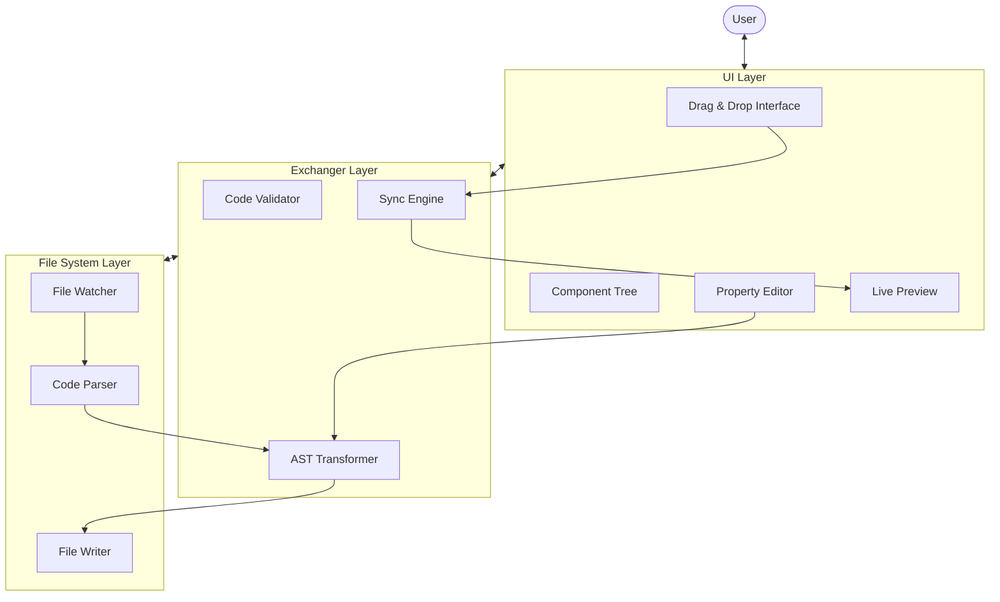

# Web Builder with Code Synchronization - Project Plan

## Project Overview

Building a web-based drag-and-drop interface builder that directly synchronizes with the underlying code files. Changes made in the visual editor will be reflected in the code and vice versa.

## How to code

Step 1. DO NOT call AI do completion entire the features with more than 3 requirements. Or else it fucked up.

## Core Architecture

### 1. System Components

- **UI Layer**: Handles drag-drop interface, component visualization, and user interactions
- **Exchanger Layer**: Mediates between UI and file system, handles validation and synchronization
- **File System Layer**: Manages the actual project files and code structure
- **Component Registry**: Manages available components and their properties
- **Preview Renderer**: Shows live preview of the application

### 2. Data Flow Diagram

### 3. Layer Responsibilities

#### UI Layer

- Component drag and drop interface
- Visual tree representation of components
- Property editors and configuration panels
- Preview rendering of components
- User interaction handling

#### Exchanger Layer

- Code validation and linting before syncing
- AST transformation and code generation
- Conflict resolution between UI and code changes
- Change tracking and differential updates
- Communication protocol between layers

#### File System Layer

- Reading and writing project files
- Parsing code into abstract syntax trees
- File change detection and monitoring
- Project structure management
- Code formatting preservation

## Development Phases

### Phase 1

- [x] Set up project structure and development environment
- [ ] Design UI, allow user can add project direction, and a button to say create project react+shadcn.
- [ ] Feature: when click on create, File System allow to init a project running by `cmd` command
  - This project right now focus on only shadcn + react
- [ ] Draft visualize the draft UI how it should display the project
  - Answer: 
- [ ] Backend UI should handle a way to communicate between file in local and UUI dynamically.

### Phase 2

- [ ] 

### Phase 3

- [ ] 

### Phase 4

- [ ] 

### Phase 5

- [ ]

## Technical Details

### Exchanger Layer Implementation

1. **Validation Pipeline**: Runs linting, type checking, and custom validation rules
2. **Transformation Engine**: Converts between UI component models and code AST
3. **Synchronization Protocol**: Defines messages and operations between UI and File System
4. **Version Control**: Tracks changes and provides conflict resolution
5. **Performance Optimization**: Batches updates and minimizes file operations

### Component Resolution Challenges

1. **Component Identification**: Track which file contains which components
2. **Import Management**: Handle component imports automatically
3. **Children Props**: Resolve what content appears in {children} placeholders
4. **State and Props**: Track and modify component state and props correctly

## Success Metrics

- Accurate bidirectional sync between UI and code
- Preservation of code style and comments
- Performance with large component trees
- User experience fluidity

## Future Expansion

### Potential Features

- Cloud storage integration
- Multi-user collaboration
- Component marketplace
- Custom code generators for different frameworks
- Export functionality for standalone projects

